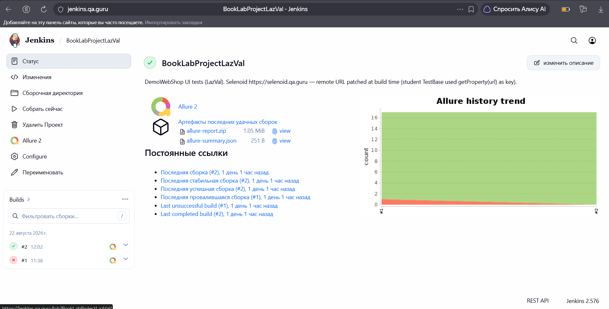

# Test Automation Project for [BookLabProject](https://book-club.qa.guru/api/v1/docs/swagger/)

## **Contents:** ##
* <a href="#tools">Technologies and tools</a>
* <a href="#cases">Examples of automated test cases</a>
* <a href="#jenkins">Build in Jenkins</a>
* <a href="#console">Run from Terminal</a>
* <a href="#allure">Allure report</a>
* <a href="#telegram">Telegram notification with bot</a>

-----
<a id="tools"></a>
## <a name="Technologies and tools">**Technologies and tools:**</a>

<p align="center">
<a href="https://www.w3schools.com/java/">  </a> 
<a href="https://www.jetbrains.com/idea/">  </a> 
<a href="https://git-scm.com/">  </a> 
<a href="https://junit.org/junit5">  </a>
<a href="https://rest-assured.io/">  </a>
<a href="https://gradle.org">  </a>
<a href="https://allurereport.org/">  </a>
<a href="https://www.jenkins.io">  </a>
</p>

- The API autotests were written in **Java**.
- **Gradle** was used as the builder.
- **JUnit 5** and **REST-assured** were used as test frameworks.
- For remote run, a job in **Jenkins** with **Allure report** generation and result sending to **Telegram** using a bot has been implemented.

----
<a id="cases"></a>
## **Examples of automated test cases:**

**Endpoint `POST /users/register/`**
- ✅ Successful user registration
- ✅ Getting an error 'User already exists'
- ✅ Getting an error 404 Not Found

**Endpoint `POST /auth/token/`**
- ✅ Successful user authorization
- ✅ Getting an error 'Invalid username or password'
- ✅ Getting an error 'Field cannot be empty'
- ✅ Getting an error '405'

**Endpoint `POST /auth/logout/`**
- ✅ Successful user logout
- ✅ Getting an error 'Field cannot be empty'

**Endpoint `/clubs/`**
- ✅ Successful club creation (POST /clubs/)
- ✅ Getting detailed club information (GET /clubs/)
- ✅ Changing the book title and author (PATCH /clubs/)
- ✅ Deleting a club (DELETE /clubs/)

**Endpoint `/users/me/`**
- ✅ Getting user information (GET /users/me/)
- ✅ Updating user data (PATCH /users/me/)
- ✅ Getting an authorization error (GET /users/me/)

----
<a id="jenkins"></a>
## Build in Jenkins ([link](https://jenkins.qa.guru/job/BookLabProjectLazVal/))

<p align="center">  
<a href="https://jenkins.qa.guru/job/BookLabProjectLazVal/"></a>  
</p>

> No build parameters are required.

----
<a id="console"></a>
## Run from Terminal

**Local launch**
```bash  
gradle clean test
